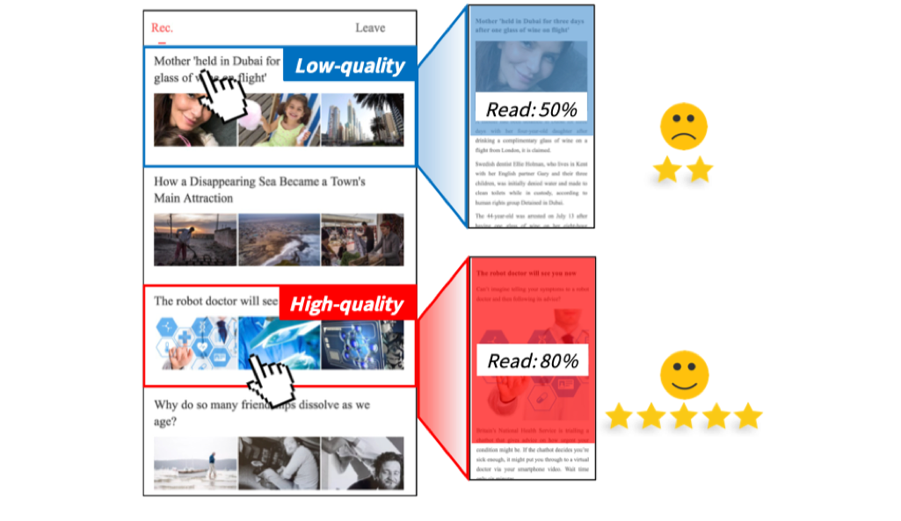

## 一、信息流推荐场景下的用户行为分析

### 案例简介

想要做好一个推荐系统，首先要了解用户，了解用户的行为、偏好、行为与偏好的关系。在本实验中，我们会提供给同学们一个信息流推荐（新闻推荐）场景下的用户行为数据，该数据记录了实验参与用户在手机上阅读新闻信息流时的行为和体验。浏览过程中，实验平台记录了用户的滑动、点击等行为，用户在阅读新闻前、阅读新闻后、实验最后都会对新闻阅读的满意度给出评价。同学们需要分析用户行为，了解行为和偏好的关系，得到对构建推荐系统有帮助的信息和结论，比如哪些行为能体现用户的偏好、偏好在使用过程中的变化。这是一个较开放的任务，希望同学们各显神通，能够科学合理地分析和总结出一些有意思的结论。

### 案例说明

该数据采集自THUIR用户实验室。场景是用户在移动环境下（安卓应用）阅读新闻信息流。实验过程中会记录用户的行为并让用户进行一系列的标注。

-   用户交互界面和一般的新闻信息流App类似（如今日头条），是一个单栏的新闻列表，列表中每个元素是一条新闻，包括新闻标题和三张图片。
    用户可以向下滑动看完整个列表。当点击某个元素时，界面会跳转到完整新闻内容页面。

-   实验用户（被试）除了预实验之外，正式实验会被要求做11个阅读任务（Task），每个任务是一个新闻列表，包含15条不同的新闻，且不同任务列表间的新闻无交集。
    每个用户的11个阅读列表原始是相同的，但列表顺序会打乱，且可能会在每个任务列表中插入一些低质量的新闻。

-   被试会在给定的1280*720像素手机上进行实验：
    -   （Stage 0）在实验开始时，会询问用户一些问题。比如会让用户标注他在5个主题上的偏好，1-5分递增。（社会social, 娱乐enterprise, 科技technology, 历史history, 体育sport）
    -   （Stage 1）为了让被试熟悉实验环境，会进行一项预实验，不记录。接下来开始正式实验。
    -   （Stage 2）被试阅读任务列表的场景信息和注意事项。
    -   （Stage 3）被试阅读新闻列表，不一定每条都读，按自己平时的阅读兴趣来阅读，也不限时间，可以随时退出列表。
    -   （Stage 4）结束该任务列表后，用户会被要求对新闻列表的整体情况给一些包括满意度在内的反馈。
    -   （Stage 5）在给出列表反馈后，用户也会被要求给出列表中每条新闻的偏好反馈。
    -   Stage 2-5会重复直到用户完成所有11个任务列表。
-   在实验结束后，会再次询问被试一些问题，比如实验后在5个主题上的偏好，以对比实验前。

-   为了探究用户在不同阶段对新闻的偏好：
    -   Before-Read：在用户点击新闻后跳转到内容页面前会询请该用户对新闻进行偏好评分，1-5递增。
    -   After-Read：在用户阅读完新闻，离开内容页面时，会再次询问用户对新闻对偏好，并对内容质量和标题内容一致性进行评分，1-5递增。
    -   Post-Task：上面两种偏好可能受到列表内容、新闻位置等影响，为消除这些影响，在任务完成之后，会请用户对列表中所有的新闻再次进行偏好评分（包括未点击的新闻）

-   为了探究用户点击新闻的原因：
    -   在After-Read阶段，会询问用户点击该新闻的原因，分5种
        1. 被标题吸引 
        2. 被图片吸引 
        3. 被话题吸引
        4. 误点击 
        5. 以上都不是

-   为了探究新闻质量对用户偏好对影响，会在每个任务列表中插入一些低质量的新闻，插入数目（condition）有四种情况，0/3/6/9个。

通过对实验数据的分析，你将：

-   对用户在整个信息流推荐过程中的行为和偏好变化有更深入的了解
-   对如何进行用户实验有所了解
-   学习如何分析用户行为数据
-   学习如何通过用户数据来得到结论，引导推荐系统的构建

### 作业要求

-   分析数据并得到至少三个对构建推荐系统有帮助的结论
    -   结论需要有数据支撑，可以通过图示或数据表格来展示
    -   阐述该结论可以如何指导或帮助推荐系统的构建
-   考察的核心知识点：用户行为分析

### 作业提示（请发散思维，不限于以下提示）

-   点击行为是否与用户偏好完全一致？
-   用户在不同阶段对消费的满意程度是否有变化？
-   哪些因素或行为能体现用户的满意程度？